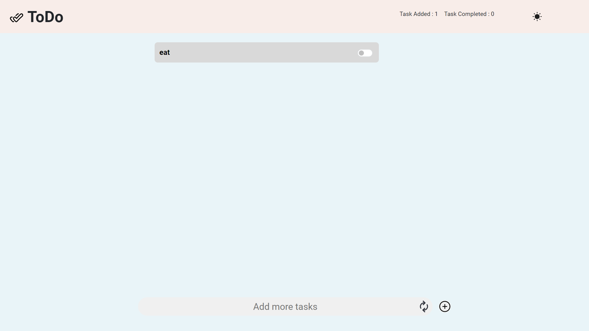

# To Do List
A simple Todo website built using HTML, CSS, JavaScript, and Bootstrap.

# Features
Add, delete, and mark tasks as completed
Responsive design

# Technologies 
HTML5
CSS3
JavaScript
Bootstrap

# Usage
1. Add a task using the input field and "Add" button.
2. Mark tasks as completed with the checkbox.
3. Delete tasks with the "Delete" button.

# Installation
1. Clone the repository
  git clone https://github.com/lakshaylalia/To-Do-List.git
2. Open 'index.html' in your browser.

# Contact
For question, reach out to lakshaylalia@gmail.com
